<div align="center">



# barakah

**Prayer times in your menu bar, with iqama reminders and media that actually stops.**<br>
*The athan plays in full, and pauses whatever you were listening to.*

</div>

---

Barakah is a macOS menu bar app for the five daily prayers. It does three things,
and tries to do them without gaps:

- **Prayer times**, calculated on your Mac, offline, for anywhere in the world.
- **Iqama reminders** — a notification some minutes *before* iqama, not just at
  the athan, because the athan is not the thing you are trying not to miss.
- **Media that stops.** When the athan begins, whatever you were listening to
  pauses, and comes back afterwards if you want it to.

It is a menu bar app: no Dock icon, no window unless you open one.

## Install

```sh
brew install --cask justin06lee/tap/barakah
```

Or build it yourself:

```sh
git clone https://github.com/justin06lee/barakah.git
cd barakah
make
```

A bare `make` builds the app, clears any stale privacy grants left by a previous
build, installs to `/Applications`, and launches it. Requires macOS 14 or later.

## The three things

### Prayer times

Times come from [adhan-swift][adhan], the same calculation library most serious
prayer apps use. All the usual conventions are supported — Muslim World League,
ISNA, Umm al-Qura, Egyptian, Karachi, Dubai, Qatar, Kuwait, Singapore, Diyanet,
Tehran, and the Moonsighting Committee — along with both Asr conventions, and the
three high-latitude rules for places where the sun does not cooperate in summer.

If your masjid publishes times a minute or two off the astronomical values, you
can nudge each prayer individually under **Calculation → Fine adjustment** rather
than living with a mismatch.

Location comes from CoreLocation, or you can pin a city by name. Times are always
calculated in the *location's* timezone, so pinning your hometown while abroad
gives you your hometown's times, correctly.

### Iqama

Iqama is not calculable. It is whatever your masjid decided, and no amount of
astronomy will tell you. So Barakah asks, per prayer, in the two shapes masjids
actually use:

- **After the athan** — "Athan + 10 minutes", the common case.
- **A fixed time** — "Dhuhr is always 1:30", the other common case.

Each prayer gets its own rule, its own reminder ("remind me 5 minutes before
iqama"), and optionally an alert at the iqama itself. Friday gets a **Jumu'ah**
override, because Jumu'ah rarely runs on Dhuhr's schedule.

Reminders are scheduled with the system ahead of time rather than posted by a
running timer, so they still arrive if Barakah was quit, crashed, or the machine
only just woke up.

### Media

This is the part that is easy to do badly, so here is exactly how it works.

There is no public "pause everything" API on macOS. Barakah uses three
strategies, strongest first, and each covers what the others miss:

| Strategy | Reaches | Needs |
|---|---|---|
| **Direct app control** — Apple Events | Spotify, Music, TV, Podcasts, VLC, QuickTime | Automation permission, once |
| **Now Playing** — the same channel as the ⏯ key | Browsers (Safari, Chrome, Arc), IINA, and most players | nothing |
| **Output muting** — CoreAudio | Literally everything else: games, calls, emulators | nothing |

Two details that matter more than the list:

**Barakah only ever sends an explicit *pause*, never a play/pause *toggle*.**
A toggle sent when nothing is playing starts music — in the middle of the adhan.
An explicit pause sent when nothing is playing does nothing at all. That is the
difference between a feature and a bug, and it is why the second row above is
safe to fire blindly.

**It knows what it paused, so it can put it back.** Since macOS 15.4, Apple
hides Now Playing information from apps without a private entitlement — on
macOS 26 the API will report "nothing is playing" while music is audibly
playing. Barakah works around this with the public per-process CoreAudio API
(`kAudioHardwarePropertyProcessObjectList`, macOS 14.4+), which reports exactly
which applications are producing sound. That is what lets it say "Paused
Spotify" rather than "Paused playback", and what lets it resume only playback it
genuinely interrupted.

If it cannot tell whether anything was playing, it does not resume. Starting
audio nobody asked for is worse than leaving it paused.

**Settings → Media** runs a live probe of your Mac and tells you which of these
work, rather than letting you discover a gap at Fajr.

## The athan

Barakah plays the athan itself, through its own audio engine, rather than
attaching a sound to a notification. Notification sounds are capped at 30
seconds — a real adhan runs two to four minutes — and cannot be stopped once
they start.

Playing it directly means:

- it runs its **full length**,
- **one click on the menu bar icon stops it**, from anywhere, and
- a small floating window shows what is playing, what got paused, and offers
  stop and resume without hunting for the icon.

Per prayer you can choose whether the athan sounds at all, and Fajr can have its
own recording — it has the extra line, `الصلاة خير من النوم`.

### Barakah ships no adhan recording

The default sound is a bell synthesised at runtime. That is deliberate.

The *text* of the adhan is roughly 1400 years old and unquestionably public
domain. A **recording** of it is not: it carries the muezzin's performer's
rights and the sound-recording copyright of whoever made it. Every adhan
recording made in living memory is under copyright, and no mosque, waqf, or
well-known muezzin has released one under a free licence.

Nearly every open-source prayer app bundles named-reciter recordings anyway,
under a blanket MIT or GPL code licence, with no audio licence and no
attribution. One ships 47 of them. That is a habit, not a defence, and this
project does not copy it.

So there are two honest paths instead:

```sh
make adhan              # list what's available
./scripts/fetch-adhan.sh adhan
```

which downloads a genuinely CC0 field recording into
`~/Library/Application Support/Barakah/Athan/` and normalises it to a usable
level — nothing copyrighted ever enters this repository. Or point Barakah at a
recording you already have rights to: **Settings → Athan → Choose a file…**.
Either way it appears in the sound picker immediately.

[`assets/NOTICE.md`](assets/NOTICE.md) documents this in full, including the two
widely-reused Wikimedia files that are tagged CC0 but are measurably
re-encoded MP3s, and the "public domain" recording justified on the grounds that
"Adhan has been in effect since c.622 A.D." — a 1985 performance by a singer who
died in 2021.

## Keeping time when macOS does not

A prayer reminder is only as good as its worst day, so the scheduler is built
around the ways long-lived timers actually fail:

- **Sleep.** Timers do not fire while the machine is asleep. On wake, the whole
  schedule is rebuilt, and anything missed is **skipped rather than replayed** —
  an adhan for a prayer that passed two hours ago is worse than none.
- **Clock and timezone changes.** Both are observed and trigger a rebuild, so
  crossing a timezone or an NTP correction cannot leave a stale armed time.
- **Midnight.** Tomorrow's Fajr is armed before tonight's Isha has finished.
- **A timer that simply does not fire.** A slow heartbeat independently checks
  for events that came due, so a dropped timer costs seconds rather than a prayer.

## Settings

| Tab | What is in it |
|---|---|
| **Location** | Automatic or a pinned city; shows exactly what is in use |
| **Calculation** | Method, madhab, high-latitude rule, per-prayer fine adjustment |
| **Iqama** | Per-prayer rule and reminder; Jumu'ah override |
| **Athan** | Sound, volume, which prayers sound, the floating window |
| **Media** | Per-prayer behaviour, resume policy, and a live capability probe |
| **General** | Launch at login, menu bar format, 24-hour clock, Hijri date |

Settings live in `~/Library/Application Support/Barakah/settings.json` as plain,
readable JSON.

## Development

```sh
make          # build, install, and run — the whole path
make build    # compile only
make test     # run the test suite
make update   # stop, wipe stale grants, rebuild, reinstall, relaunch
make dmg      # package a disk image
make clean
```

The code is Swift 6 and SwiftUI, no Xcode project — SwiftPM builds the binary
and the Makefile assembles the `.app`.

```
Sources/Barakah/
├── Model/      Prayer kinds, iqama rules, settings — plain values, no I/O
├── Services/   Time calculation, scheduling, audio, location, notifications
├── Media/      The three pause strategies and the controller that layers them
└── UI/         Menu bar, panel, athan window, settings
```

The interesting seams are [`Scheduler.swift`](Sources/Barakah/Services/Scheduler.swift)
(everything above about timers), [`MediaController.swift`](Sources/Barakah/Media/MediaController.swift)
(the layering), and [`AudioActivity.swift`](Sources/Barakah/Media/AudioActivity.swift)
(the public API that replaces the gated one).

### Permissions

Barakah asks for **Location** (to calculate times), **Notifications** (for iqama
reminders), and **Automation** (to pause Spotify, Music, VLC and QuickTime).
Everything is computed locally. Nothing is sent anywhere — there is no network
code in the app at all.

macOS ties Automation grants to a binary's code signature, so every rebuild of a
locally-signed build silently invalidates them while System Settings keeps
showing the old entry as enabled. `make` and `make update` clear the stale
entries for you; you should never need to go and remove one by hand.

## Licence

MIT — see [`LICENSE`](LICENSE). Third-party assets and their separate licences
are documented in [`assets/NOTICE.md`](assets/NOTICE.md).

[adhan]: https://github.com/batoulapps/adhan-swift
