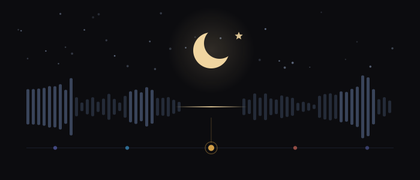

<div align="center">



# barakah

**Prayer times in your menu bar, with iqama reminders and media that actually stops.**<br>
*The athan plays in full, and pauses whatever you were listening to.*

</div>

---

Barakah is a macOS menu bar app for the five daily prayers. It does three things,
and tries to do them without gaps:

- **Prayer times**, calculated on your Mac, offline, for anywhere in the world.
- **Iqama reminders** — a notification some minutes *before* iqama, not just at
  the athan, because the athan is not the thing you are trying not to miss.
- **Media that stops.** When the athan begins, whatever you were listening to
  pauses, and comes back afterwards if you want it to.

It is a menu bar app: no Dock icon, no window unless you open one. On Linux the
same app lives in the GNOME top bar as a tray icon — see [On Linux](#on-linux).

## Install

Requires macOS 14 (Sonoma) or later. For Linux, see [On Linux](#on-linux).

**Download the app** — [latest release](https://github.com/TheOddjobShop/barakah/releases/latest).
Open the `.dmg` and drag Barakah into Applications.

The first launch needs one extra step, because Barakah is not signed with a paid
Apple Developer certificate. macOS will say it *"could not verify Barakah is free
of malware"* and refuse to open it. To let it through:

1. Click **Done** on the warning.
2. Open **System Settings → Privacy & Security**.
3. Scroll down. There is a line saying *"Barakah was blocked to protect your Mac."*
   Click **Open Anyway** next to it.
4. Confirm with **Open Anyway**, and enter your password.

That is a one-time step. Barakah opens normally from then on, and there is no
Dock icon — look for the crescent in your menu bar.

**With Homebrew:**

```sh
brew install --cask justin06lee/tap/barakah
```

**From source:**

```sh
git clone https://github.com/TheOddjobShop/barakah.git
cd barakah
make
```

A bare `make` builds the app, clears any stale privacy grants left by a previous
build, installs it to `/Applications`, and launches it.

## The three things

### Prayer times

Times come from [adhan-swift][adhan], the same calculation library most serious
prayer apps use. All the usual conventions are supported — Muslim World League,
ISNA, Umm al-Qura, Egyptian, Karachi, Dubai, Qatar, Kuwait, Singapore, Diyanet,
Tehran, and the Moonsighting Committee — along with both Asr conventions, and the
three high-latitude rules for places where the sun does not cooperate in summer.

If your masjid publishes times a minute or two off the astronomical values, you
can nudge each prayer individually under **Calculation → Fine adjustment** rather
than living with a mismatch.

Location comes from CoreLocation, or you can pin a city by name. Times are always
calculated in the *location's* timezone, so pinning your hometown while abroad
gives you your hometown's times, correctly.

### Iqama

Iqama is not calculable. It is whatever your masjid decided, and no amount of
astronomy will tell you. So Barakah asks, per prayer, in the two shapes masjids
actually use:

- **After the athan** — "Athan + 10 minutes", the common case.
- **A fixed time** — "Dhuhr is always 1:30", the other common case.

Each prayer gets its own rule, its own reminder ("remind me 5 minutes before
iqama"), and optionally an alert at the iqama itself. Friday gets a **Jumu'ah**
override, because Jumu'ah rarely runs on Dhuhr's schedule.

Reminders are scheduled with the system ahead of time rather than posted by a
running timer, so they still arrive if Barakah was quit, crashed, or the machine
only just woke up.

### Media

This is the part that is easy to do badly, so here is exactly how it works.

There is no public "pause everything" API on macOS. Barakah uses three
strategies, strongest first, and each covers what the others miss:

| Strategy | Reaches | Needs |
|---|---|---|
| **Direct app control** — Apple Events | Spotify, Music, TV, Podcasts, VLC, QuickTime | Automation permission, once |
| **Now Playing** — the same channel as the ⏯ key | Browsers (Safari, Chrome, Arc), IINA, and most players | nothing |
| **Output muting** — CoreAudio | Literally everything else: games, calls, emulators | nothing |

Two details that matter more than the list:

**Barakah only ever sends an explicit *pause*, never a play/pause *toggle*.**
A toggle sent when nothing is playing starts music — in the middle of the adhan.
An explicit pause sent when nothing is playing does nothing at all. That is the
difference between a feature and a bug, and it is why the second row above is
safe to fire blindly.

**It knows what it paused, so it can put it back.** Since macOS 15.4, Apple
hides Now Playing information from apps without a private entitlement — on
macOS 26 the API will report "nothing is playing" while music is audibly
playing. Barakah works around this with the public per-process CoreAudio API
(`kAudioHardwarePropertyProcessObjectList`, macOS 14.4+), which reports exactly
which applications are producing sound. That is what lets it say "Paused
Spotify" rather than "Paused playback", and what lets it resume only playback it
genuinely interrupted.

If it cannot tell whether anything was playing, it does not resume. Starting
audio nobody asked for is worse than leaving it paused.

**Settings → Media** runs a live probe of your Mac and tells you which of these
work, rather than letting you discover a gap at Fajr.

## The athan

Barakah plays the athan itself, through its own audio engine, rather than
attaching a sound to a notification. Notification sounds are capped at 30
seconds — a real adhan runs two to four minutes — and cannot be stopped once
they start.

Playing it directly means:

- it runs its **full length**,
- **one click on the menu bar icon stops it**, from anywhere, and
- a small floating window shows what is playing, what got paused, and offers
  stop and resume without hunting for the icon.

Per prayer you can choose whether the athan sounds at all, and Fajr can have its
own recording — it has the extra line, `الصلاة خير من النوم`.

### The adhan it plays

Barakah includes an adhan and uses it by default, so it works properly the
moment you open it.

Which recording that is took some care. The *text* of the adhan is roughly 1400
years old and is public domain by age, but a **recording** of it is a separate
work: it carries the muezzin's performance rights and the sound-recording
copyright of whoever made it. Every adhan recording made in living memory is
under copyright, and no mosque, waqf, or well-known muezzin has released one
freely. Sites offering adhan downloads at no charge are offering them to listen
to — free of charge is not free to redistribute.

What does exist is amateur field recordings whose recordist dedicated their own
work to the public domain. Barakah bundles one of those, verified CC0 against
the Wikimedia Commons API before it went in, and normalised to a sensible level.
[`assets/NOTICE.md`](assets/NOTICE.md) has the full attribution and provenance —
including the widely-reused files that *claim* CC0 but are measurably re-encoded
commercial recordings, and how to tell the difference.

**To use your own instead** — a particular muezzin, or your own masjid — drag it
onto the welcome window at first launch, or later use **Settings → Athan →
Choose a file…**. You can also drop a file into
`~/Library/Application Support/Barakah/Athan/` and it appears in the sound list
straight away, no restart. `.m4a`, `.mp3`, `.caf`, `.wav`, `.aiff` and `.ogg`
all work, and a file of yours named the same as the bundled one takes
precedence.

Whatever you add gets **level-matched on playback**. Recordings in the wild are
mastered nowhere near each other — measured examples run from −27 dBFS to
−9 dBFS, an eighteen-decibel spread — so without correction the volume slider
means nothing and your athan either startles you or goes unheard. Barakah
measures each file once and adjusts, so the slider does what it says.

## Keeping time when macOS does not

A prayer reminder is only as good as its worst day, so the scheduler is built
around the ways long-lived timers actually fail:

- **Sleep.** Timers do not fire while the machine is asleep. On wake, the whole
  schedule is rebuilt, and anything missed is **skipped rather than replayed** —
  an adhan for a prayer that passed two hours ago is worse than none.
- **Clock and timezone changes.** Both are observed and trigger a rebuild, so
  crossing a timezone or an NTP correction cannot leave a stale armed time.
- **Midnight.** Tomorrow's Fajr is armed before tonight's Isha has finished.
- **A timer that simply does not fire.** A slow heartbeat independently checks
  for events that came due, so a dropped timer costs seconds rather than a prayer.

## Settings

| Tab | What is in it |
|---|---|
| **Location** | Automatic or a pinned city; shows exactly what is in use |
| **Calculation** | Method, madhab, high-latitude rule, per-prayer fine adjustment |
| **Iqama** | Per-prayer rule and reminder; Jumu'ah override |
| **Athan** | Sound, volume, which prayers sound, the floating window |
| **Media** | Per-prayer behaviour, resume policy, and a live capability probe |
| **General** | Launch at login, menu bar format, 24-hour clock, Hijri date |

Settings live in `~/Library/Application Support/Barakah/settings.json` as plain,
readable JSON.

## On Linux

Barakah also runs on Linux, as a GNOME tray app built from `linux/` in this
repository. The same `make` does the right thing on each system:

```sh
git clone https://github.com/TheOddjobShop/barakah.git
cd barakah
make
```

On Linux a bare `make` checks the dependencies, installs Barakah for your user
under `~/.local` (no root needed), adds it to the app grid, and launches it. Look
for the crescent in the top bar. `git pull && make` updates it; `make uninstall`
removes it.

It needs Python 3.9+, PyGObject, GTK 3, AyatanaAppIndicator and GStreamer — all
already present on a stock Ubuntu desktop. If `make` reports something missing,
it prints the exact package list; on Ubuntu or Debian that is:

```sh
sudo apt install python3-gi gir1.2-gtk-3.0 gir1.2-ayatanaappindicator3-0.1 \
  gir1.2-gstreamer-1.0 gir1.2-gst-plugins-base-1.0 gstreamer1.0-plugins-good \
  gstreamer1.0-plugins-bad libnotify-bin gir1.2-geoclue-2.0 gir1.2-gweather-4.0
```

On GNOME the tray icon needs the AppIndicator extension, which Ubuntu enables by
default; KDE, XFCE, Cinnamon and Budgie show tray icons natively.

### Why it is built the way it is

The Linux build is a Python app on PyGObject rather than a Swift one. Swift's
toolchain is a large install on Linux and SwiftUI does not exist there, so the
interface would have had to be rewritten anyway. What Linux desktops already
ship is Python with bindings to GTK, the tray, GStreamer and D-Bus. So Barakah
installs with nothing to compile and no new packages on a stock Ubuntu desktop,
and each macOS piece maps onto the thing a Linux desktop already uses for it:

| macOS | Linux |
|---|---|
| Menu bar item and popover | AppIndicator tray icon; its menu is the day view |
| adhan-swift | [`linux/barakah/adhan.py`](linux/barakah/adhan.py), a line-for-line port of adhan-swift 1.5.0 |
| CoreLocation | GeoClue (GNOME's location service); cities and place names from libgweather's offline database |
| Scheduled user notifications | A systemd user timer per notification, running `notify-send` |
| Now Playing and Apple Events | MPRIS over D-Bus, explicit `Pause` only |
| CoreAudio output mute | PipeWire: mutes every *other* app's stream, so the athan stays audible |
| AVAudioPlayer | GStreamer `playbin` |
| Login item | `~/.config/autostart` entry |
| Umm al-Qura calendar | the system's ICU, which is what Foundation uses underneath |

**The times are the same to the second.** The port is checked against the Swift
engine itself: `Tests/BarakahTests/LinuxParityTests.swift` runs the macOS app's
`PrayerTimeEngine` over thirteen places, every method, both madhhabs, all
high-latitude rules and eight dates (solstices, both DST changes, polar days),
plus fully configured settings files with iqama rules and Jumu'ah, and writes
the results to `linux/tests/parity.json`. The Linux tests must reproduce that
file exactly, and the Swift test fails if the engine drifts from it.

Settings are the same JSON file, in the same format, at
`~/.config/barakah/settings.json` — a settings file copied from a Mac works
unchanged. Your own recordings go in `~/.local/share/barakah/Athan/`.

### What is different on Linux

- **Stopping the athan takes two clicks, not one.** GNOME always opens a tray
  icon's menu on click, so "Stop athan" is the first item in that menu. The
  floating athan panel has a Stop button too, and needs no menu at all.
- **Automatic location needs Location Services on.** GeoClue honours
  *Settings → Privacy → Location*. With it off, Barakah says so and uses the
  last known place; search for your city or enter coordinates in
  *Settings → Location* instead. City search is offline.
- **Notifications survive a quit, not a logout.** Timers belong to your user
  session, so they keep firing if Barakah quits or crashes, and are recreated
  when it next starts.
- **"Pause and mute" mutes other apps, not the speakers.** Muting the output
  device on Linux would silence the athan too; muting each other stream does
  what the Mac's device mute is for.
- **Audio activity is honest.** MPRIS players report whether they are really
  playing, so Barakah always knows what it paused and resumes exactly that.

A few commands help on a machine you reach over ssh:

```sh
barakah --times              # today's schedule from your settings
barakah --test-athan maghrib # the athan moment now: pause, play, panel
barakah --settings location  # open Settings at a tab
```

## Development

```sh
make          # build, install, and run — the whole path
make build    # compile only
make test     # run the test suite (Swift, then the Linux port's Python tests)
make update   # stop, wipe stale grants, rebuild, reinstall, relaunch
make dmg      # package a universal disk image
make clean
```

On Linux the same names do the same jobs for the tray app — `make`, `make build`
(check dependencies and stage), `make install`, `make update`, `make test`,
plus `make uninstall`.

The code is Swift 6 and SwiftUI, no Xcode project — SwiftPM builds the binary
and the Makefile assembles the `.app`. The Linux app is Python 3 on PyGObject.

```
Sources/Barakah/
├── Model/      Prayer kinds, iqama rules, settings — plain values, no I/O
├── Services/   Time calculation, scheduling, audio, location, notifications
├── Media/      The three pause strategies and the controller that layers them
└── UI/         Menu bar, panel, athan window, settings
linux/
├── barakah/    The Linux app: adhan port, engine, scheduler, tray, settings
├── data/       Tray icons, launcher and .desktop templates
├── tests/      parity.json (written by the Swift tests) and the Python tests
└── Makefile.linux
```

After a deliberate change to the calculation, regenerate the parity fixture
from the Swift engine and commit it with the change:

```sh
BARAKAH_WRITE_PARITY=1 swift test --filter LinuxParity
```

The interesting seams are [`Scheduler.swift`](Sources/Barakah/Services/Scheduler.swift)
(everything above about timers), [`MediaController.swift`](Sources/Barakah/Media/MediaController.swift)
(the layering), and [`AudioActivity.swift`](Sources/Barakah/Media/AudioActivity.swift)
(the public API that replaces the gated one).

### Permissions

Barakah asks for **Location** (to calculate times), **Notifications** (for iqama
reminders), and **Automation** (to pause Spotify, Music, VLC and QuickTime).

Prayer times are computed entirely on your Mac — the calculation is astronomy,
not a lookup, so it needs no server and works offline. Barakah opens no network
connections of its own and has no analytics, no accounts, and no telemetry.

The one exception worth naming plainly: turning coordinates into a place name
uses Apple's `CLGeocoder`, which is a network call to Apple. That happens when
you search for a city by name, and once after a location fix to label it
"Sunnyvale, CA" rather than a pair of numbers. Prayer times themselves never
depend on it — if it fails, you get the coordinates and correct times anyway.

macOS ties Automation grants to a binary's code signature, so every rebuild of a
locally-signed build silently invalidates them while System Settings keeps
showing the old entry as enabled. `make` and `make update` clear the stale
entries for you; you should never need to go and remove one by hand.

## Licence

MIT — see [`LICENSE`](LICENSE). Third-party assets and their separate licences
are documented in [`assets/NOTICE.md`](assets/NOTICE.md).

[adhan]: https://github.com/batoulapps/adhan-swift
